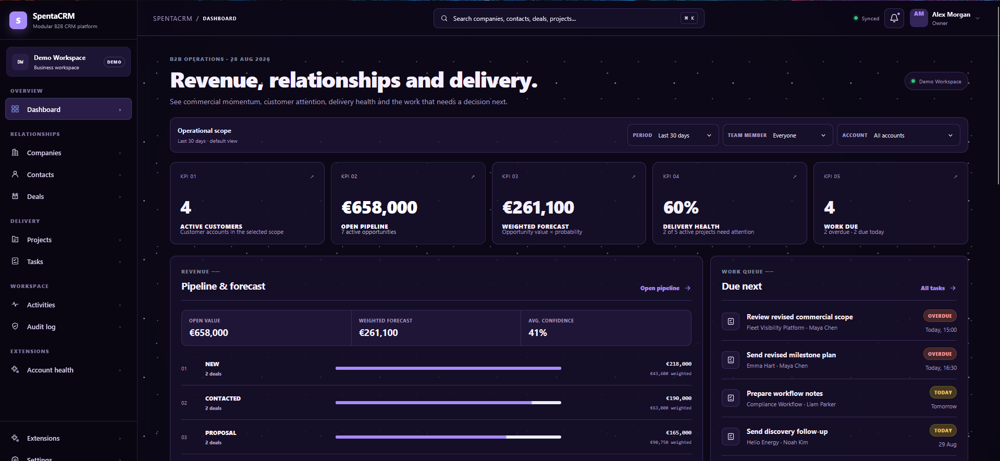
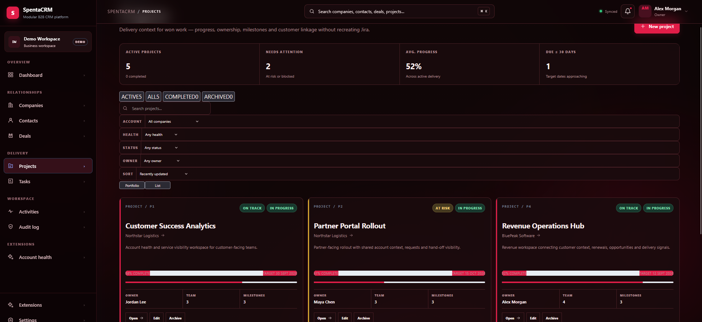
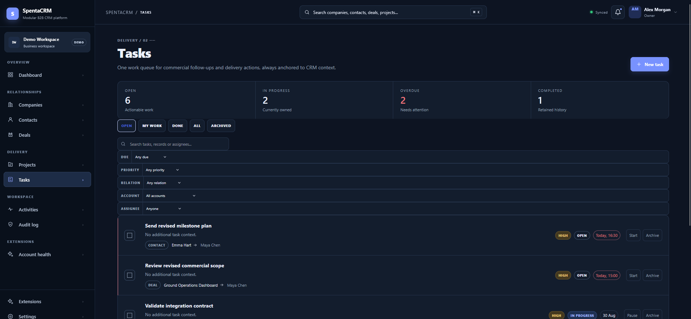
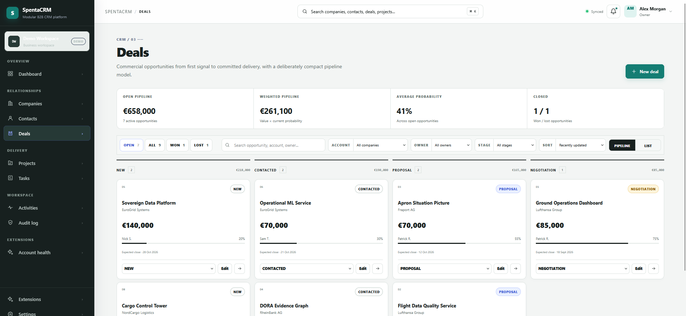

<div align="center">
  

# SpentaCRM

### Modular B2B CRM foundation for fast, company-specific deployments

**Build once. Customize freely. Extend safely. Deploy anywhere.**

[English](#english) · [فارسی](#فارسی) · [Module Runtime](./MODULES.md) · [Extensions](./EXTENSIONS.md) · [Roadmap](./FRONTEND-ROADMAP.md) · [API Contracts](./API-CONTRACTS.md)


</div>

---

## Product preview

<table>
  <tr>
    <td width="50%" align="center"><strong>Operational Dashboard</strong><br/></td>
    <td width="50%" align="center"><strong>Projects & Delivery</strong><br/></td>
  </tr>
  <tr>
    <td width="50%" align="center"><strong>Tasks & Work Queue</strong><br/></td>
    <td width="50%" align="center"><strong>Deals & Pipeline</strong><br/></td>
  </tr>
</table>

---

# English

## What is SpentaCRM?

**SpentaCRM** is a free B2B Customer Relationship Management project designed as a reusable foundation for organizations that need to launch a CRM quickly and then adapt it to their own processes, terminology, branding, integrations, and business rules.

Most companies need the same fundamental CRM building blocks: companies/accounts, contacts, opportunities, tasks, activities, projects, permissions, dashboards, audit history, search, and integrations. What differs is how those pieces are connected. SpentaCRM keeps the common foundation in the core and pushes organization-specific capabilities into configuration, themes, integrations, and installable modules.

The goal is not to create one rigid CRM for every company. The goal is to create a **CRM platform that can become different CRMs** depending on the organization using it.

> Instead of rebuilding the same CRM foundation for every customer, start with SpentaCRM and build only what makes that deployment unique.

SpentaCRM is under active development. Additional CRM models, automation, integrations, analytics, AI-assisted workflows, agentic CRM capabilities, module tooling, and deployment options are expected to evolve over time.

---

## Core product scope

### Relationship management

- Companies / Accounts
- Contacts and stakeholder relationships
- Primary contact management
- Account-level activity context
- Search, filters, sorting, and pagination-ready state
- Archive and reactivate flows

### Sales and pipeline

- Deals / Opportunities
- Pipeline and list views
- Stage-based sales workflow
- Weighted pipeline and forecast calculations
- Deal value, probability, expected close date, owner, company, and contact context
- Won / Lost / Reopen transitions
- Required loss reasons

### Delivery and projects

- Customer-facing projects
- Won Deal → Project handoff
- Delivery owner and team assignment
- Project health, progress, dates, and milestones
- Company and source-deal relationships
- Archive and reactivate lifecycle

SpentaCRM keeps project management intentionally lightweight. The purpose is to preserve commercial and delivery context inside the CRM, not to replace dedicated engineering tools such as Jira or Linear.

### Tasks and activities

- Shared work queue
- Due states and priorities
- Start, pause, complete, reopen, archive, and reactivate flows
- Tasks linked to Companies, Contacts, Deals, or Projects
- Activity timeline
- Calls, notes, meetings, emails, and other relationship events
- Context-aware task and activity creation

### Operational dashboard

- Active customer KPI
- Open pipeline
- Weighted forecast
- Delivery-health signals
- Due-work overview
- Pipeline breakdown
- Priority work queue
- Account attention radar
- Customer activity intelligence
- Account, team-member, and period scoping

### Authentication, RBAC, and administration

- Sign-in flow
- Mock and API authentication adapters
- Route protection
- Workspace settings
- User profile settings
- Member management
- Invite, suspend, and reactivate flows
- System and custom roles
- Permission-aware navigation and pages

### Auditability and productivity

- Read-only Audit Log UI
- Actor, action, and entity filtering
- Before/after event details
- Global `Cmd/Ctrl + K` search
- Deep links to CRM records
- Responsive application shell
- Loading, error, recovery, and empty states
- Suspense, streaming, and dashboard Parallel Routes

---

## Modular by design

A central goal of SpentaCRM is to let a company add capabilities **without turning the core CRM into a collection of customer-specific branches**.

SpentaCRM currently supports two extension trust models:

| Model | Best for | Installation | Execution |
| --- | --- | --- | --- |
| **Portable Module ZIP** | Company-specific pages, widgets, tabs, actions, small applications | Runtime | Sandboxed iframe |
| **Trusted Code Extension** | Deep React/TypeScript integrations that need direct core access | Build / deployment time | Trusted application code |

This separation makes it possible to support convenient runtime installation while keeping untrusted uploaded code away from the main CRM origin.

---

## Portable Module ZIPs — Module Runtime v3

A module is a **small project packaged as ZIP**. It is not just a JSON configuration file.

The JSON file is the module manifest. The actual feature is implemented by browser-ready files packaged with it.

```text
inventory-module.zip
├── spenta-module.json          # identity, permissions, contribution map
├── src/                        # optional source code for maintainability
│   ├── inventory.ts
│   └── inventory.css
├── dist/                       # browser-ready runtime surfaces
│   ├── pages/
│   │   └── inventory.html
│   ├── widgets/
│   │   └── stock-health.html
│   ├── tabs/
│   │   └── company-stock.html
│   ├── shared.css
│   └── runtime.js
└── README.md
```

`src/` is optional and may contain TypeScript, React source, build scripts, or design files. SpentaCRM does **not** compile arbitrary uploaded TypeScript at runtime. Module authors build their code first and package self-contained HTML/CSS/JS runtime entries under `dist/`.

### What a ZIP module can add today

A portable module can contribute:

- **new pages** hosted by SpentaCRM;
- **sidebar navigation** pointing to module pages;
- **dashboard widgets**;
- **entity tabs** on Company, Contact, Deal, and Project records;
- **entity actions** such as opening a module page or an external URL;
- isolated browser UI and business workflows;
- HTTPS API calls from the sandbox, subject to the runtime Content Security Policy.

This means a company can install something such as Inventory, Customer Success, Meeting Management, Expense Tracking, Account Scoring, an internal portal, or a domain-specific tool without modifying the Next.js route tree for each deployment.

### Complexity tiers

Every module can declare a descriptive complexity tier:

- **simple** — one focused capability with a small UI and minimal permissions;
- **medium** — a broader workflow with several surfaces or an external integration;
- **advanced** — multiple pages/extension points and richer company workflows;
- **professional** — enterprise-scale module structure, multiple business surfaces, audited integrations, and typically a companion backend service.

The tier describes the module; permissions still determine what it declares and what the host allows.

---

## Manifest v3 example

```json
{
  "apiVersion": 3,
  "manifest": {
    "id": "vendor.inventory",
    "name": "Inventory Management",
    "version": "1.0.0",
    "publisher": "Vendor",
    "description": "Inventory and stock management for B2B accounts.",
    "complexity": "advanced",
    "categories": ["module"],
    "permissions": [
      "runtime:sandbox",
      "ui:navigation",
      "ui:dashboard",
      "ui:entity-tabs",
      "ui:entity-actions"
    ]
  },
  "contributes": {
    "runtimePages": [
      {
        "id": "inventory",
        "title": "Inventory",
        "entry": "dist/pages/inventory.html",
        "navigation": {
          "label": "Inventory",
          "section": "extensions"
        },
        "height": "viewport"
      }
    ],
    "runtimeDashboardWidgets": [
      {
        "id": "stock-health",
        "title": "Stock health",
        "zone": "dashboard.afterStats",
        "entry": "dist/widgets/stock-health.html",
        "height": 240
      }
    ],
    "runtimeEntityTabs": [
      {
        "id": "company-stock",
        "entity": "company",
        "label": "Inventory",
        "entry": "dist/tabs/company-stock.html",
        "height": 420
      }
    ],
    "runtimeEntityActions": [
      {
        "id": "open-inventory",
        "entity": "company",
        "label": "Open Inventory",
        "tone": "primary",
        "action": {
          "type": "open-page",
          "pageId": "inventory"
        }
      }
    ]
  }
}
```

### Runtime contribution points

| Contribution | Purpose |
| --- | --- |
| `runtimePages` | Adds a complete module-owned page through SpentaCRM's stable extension host route |
| `runtimeDashboardWidgets` | Adds an isolated widget to a supported dashboard zone |
| `runtimeEntityTabs` | Adds a tab to Company, Contact, Deal, or Project extension surfaces |
| `runtimeEntityActions` | Adds an entity action; currently supports `open-page` and `open-url` |

Supported dashboard zones currently include:

```text
dashboard.afterStats
dashboard.afterPipeline
dashboard.afterActivity
dashboard.afterAccounts
```

---

## How to create and install a module

### 1. Create the module project

Keep `spenta-module.json` in the package and create any authoring source under `src/`.

### 2. Build browser-ready runtime entries

Bundle the UI so every manifest `entry` points to a real HTML file inside the ZIP. Runtime JavaScript should be bundled; SpentaCRM does not compile an uploaded npm dependency graph.

For example:

```text
dist/pages/inventory.html
dist/widgets/stock-health.html
dist/tabs/company-stock.html
```

Local CSS, JavaScript, images, and common media referenced by those HTML files can be packaged alongside them.

### 3. Create the ZIP

Package the manifest and runtime files. `spenta-module.json` is recommended as the manifest name; legacy `extension.json` is also recognized by the current installer.

Current package limits are:

- ZIP file: **16 MB maximum**;
- total uncompressed content: **32 MB maximum**;
- individual file: **8 MB maximum**;
- manifest: **512 KB maximum**;
- supported ZIP entry compression: **stored** or **deflate**;
- unsafe paths such as `../` are rejected.

### 4. Install it in SpentaCRM

In the running CRM:

```text
Sidebar → Extensions → Install module ZIP
```

Choose the ZIP. SpentaCRM reads the manifest, validates the archive, stores the package, and adds the module to **Modules & Extensions**.

### 5. Enable the module

The installed module card shows its source, version, publisher, complexity tier, declared permissions, and contribution count. Enable it for the workspace.

### 6. Use the new capability

Depending on the manifest, the module can now appear as a sidebar page, dashboard widget, entity tab, or entity action without rebuilding the Next.js frontend.

Four working package examples are included in [`module-examples/`](./module-examples/):

```text
simple-module-example.zip
medium-module-example.zip
advanced-module-example.zip
professional-module-example.zip
```

For the complete package specification, see [`MODULES.md`](./MODULES.md).

---

## Module runtime security

Portable ZIP modules are deliberately isolated.

- Package files are persisted in **IndexedDB** under a module-specific key.
- Runtime pages/widgets/tabs are loaded inside an **iframe sandbox**.
- The iframe does not receive `allow-same-origin`.
- Module code cannot directly read the parent DOM, CRM cookies, parent localStorage, or React state.
- Local module CSS/JS/assets are loaded from the installed package and assembled into an isolated runtime document.
- A Content Security Policy restricts the sandbox environment.
- Removing a ZIP module removes its registry metadata and runtime package files.

The host injects a small bridge:

```js
window.SpentaCRM.context
window.SpentaCRM.post(type, payload)
window.SpentaCRM.ready(payload)
window.SpentaCRM.resize(height)
window.SpentaCRM.navigate("/companies")
```

For entity tabs, the context can also include the current entity type and entity ID.

> Portable runtime modules are appropriate for browser-side capabilities. Privileged backend logic should live in a trusted backend/service and be exposed through an authenticated API. A future NestJS/PostgreSQL Module Registry is expected to add package signatures, tenant installation state, dependency resolution, server-side descriptors, migrations, and richer auditing.

---

## Trusted code extensions

When an extension must integrate directly with React/TypeScript internals, use the trusted extension workflow instead of an uploaded runtime ZIP.

Trusted extensions use the local SDK:

```ts
import { defineExtension } from "@spentacrm/extension-sdk";
```

The repository resolves `@spentacrm/extension-sdk` to the local SDK source in `packages/extension-sdk`, so the core application does not depend on a separately published SDK package.

Useful scripts:

```bash
pnpm extension:add -- <package>
pnpm extension:remove -- <package>
pnpm extensions:sync
```

Trusted contribution points include themes, modules, extension-owned pages, dashboard widgets, sidebar navigation, command-palette actions, and sandboxed remote modules.

See [`EXTENSIONS.md`](./EXTENSIONS.md) and [`extension-examples/`](./extension-examples/).

---

## Theme Studio and white-label customization

SpentaCRM is designed to be adapted for different organizations without forking the entire UI.

Current theme capabilities include:

- light and dark appearance;
- configurable palette and accent colors;
- radius and glass-surface controls;
- typography presets and text scaling;
- HTTPS background images;
- background opacity, blur, position, and sizing;
- sidebar, topbar, and surface transparency;
- visual effects such as `aurora`, `soft-glow`, `cyber-grid`, `scanlines`, `starfield`, `embers`, and `blood-mist`;
- effect intensity and speed;
- grain and vignette controls;
- live preview;
- theme export as an installable extension package.

Product identity and workspace defaults can also be changed through environment variables.

---

## Architecture direction

```text
┌─────────────────────────────────────────┐
│              SpentaCRM Web              │
│       Next.js + React + TypeScript      │
│                                         │
│  Core CRM ─── Extension Host ─── Modules│
└───────────────────┬─────────────────────┘
                    │ Typed HTTP/API contracts
                    ▼
┌─────────────────────────────────────────┐
│            SpentaCRM Backend            │
│          NestJS modular monolith        │
└───────────────────┬─────────────────────┘
                    │
                    ▼
┌─────────────────────────────────────────┐
│                PostgreSQL               │
└─────────────────────────────────────────┘
```

The frontend already defines integration boundaries for:

```text
/auth
/users
/workspace/settings
/workspace/members
/workspace/roles
/companies
/contacts
/deals
/projects
/tasks
/activities
/audit
/dashboard
/extensions
```

See [`API-CONTRACTS.md`](./API-CONTRACTS.md) for DTOs, permissions, and backend invariants.

---

## Tech stack

| Area | Technology |
| --- | --- |
| Framework | Next.js 16.3.3 |
| UI | React 19.2.8 |
| Language | TypeScript 5.8 |
| Routing | Next.js App Router |
| Rendering | Server Components + Client Components where needed |
| Async UI | Suspense, streaming, loading/error boundaries |
| Portable modules | Module Runtime API v3 + sandboxed iframe host |
| Extension SDK | `@spentacrm/extension-sdk` → local repository SDK |
| Package persistence | IndexedDB for runtime module packages |
| Linting | ESLint 9 |
| Runtime | Node.js 20.9+ |
| Planned backend | NestJS |
| Planned database | PostgreSQL |

---

## Getting started

### Prerequisites

- **Node.js 20.9+**
- **pnpm** recommended, or npm

### 1. Clone

```bash
git clone <YOUR_SPENTACRM_REPOSITORY_URL>
cd spentaCRM
```

### 2. Install dependencies

```bash
pnpm install
```

or:

```bash
npm install
```

If you are replacing an older SpentaCRM archive, clear stale dependencies/build cache once:

```bash
rm -rf node_modules .next
pnpm install
```

PowerShell:

```powershell
Remove-Item -Recurse -Force node_modules, .next -ErrorAction SilentlyContinue
pnpm install
```

### 3. Configure environment

```bash
cp .env.example .env.local
```

PowerShell:

```powershell
Copy-Item .env.example .env.local
```

### 4. Run

```bash
pnpm dev
```

Open `http://localhost:3000`.

### Demo account

```text
Email:    alex@example.com
Password: demo1234
```

Demo authentication exists for the standalone frontend. Production authentication should be provided by the backend using secure session/cookie infrastructure.

---

## Authentication modes

Standalone demo:

```env
NEXT_PUBLIC_AUTH_ADAPTER=mock
```

Backend API mode:

```env
NEXT_PUBLIC_AUTH_ADAPTER=api
NEXT_PUBLIC_API_URL=https://api.example.com/api/v1
```

Production access/refresh credentials should not be copied into browser `localStorage` simply to mirror the mock adapter.

---

## White-label configuration

```env
NEXT_PUBLIC_APP_NAME=SpentaCRM
NEXT_PUBLIC_APP_SHORT_NAME=Spenta
NEXT_PUBLIC_APP_TAGLINE=Modular B2B CRM platform
NEXT_PUBLIC_APP_VERSION=v0.13.2
NEXT_PUBLIC_WORKSPACE_NAME=Demo Workspace
NEXT_PUBLIC_WORKSPACE_PLAN=Business
NEXT_PUBLIC_LOCALE=en-GB
NEXT_PUBLIC_DEFAULT_CURRENCY=EUR
NEXT_PUBLIC_DEFAULT_TIMEZONE=Europe/Berlin
```

Central configuration:

```text
src/config/product.ts
```

---

## Available scripts

| Command | Description |
| --- | --- |
| `pnpm dev` | Start the development server |
| `pnpm build` | Build the production frontend |
| `pnpm start` | Start the production server |
| `pnpm lint` | Run ESLint |
| `pnpm lint:fix` | Run ESLint and fix supported issues |
| `pnpm typecheck` | Run TypeScript checks |
| `pnpm check` | Typecheck + lint + production build |
| `pnpm extensions:sync` | Regenerate the trusted extension registry |
| `pnpm extension:add -- <package>` | Register a trusted code extension |
| `pnpm extension:remove -- <package>` | Remove a trusted extension from the registry |

The trusted extension registry is synchronized automatically before development and production builds.

---

## Project structure

```text
spentaCRM/
├── public/
│   └── assets/
│       ├── brand/                 # SpentaCRM brand assets
│       └── screenshots/           # README/product screenshots
├── src/
│   ├── app/                       # App Router routes and route groups
│   ├── auth/                      # Authentication providers/adapters
│   ├── components/                # CRM feature components
│   ├── config/                    # Product/workspace configuration
│   ├── extensions/                # Registry, ZIP parser, runtime and persistence
│   └── lib/                       # Shared domain/API utilities
├── packages/
│   └── extension-sdk/             # Local SpentaCRM extension SDK
├── module-examples/               # Simple → professional ZIP module examples
├── extension-examples/            # Trusted/theme/remote examples
├── scripts/                       # Extension registry management
├── API-CONTRACTS.md
├── DESIGN-NOTES.md
├── EXTENSIONS.md
├── FRONTEND-ROADMAP.md
├── MODULES.md
├── OPTIMIZATION.md
├── PUBLIC-PRODUCT.md
└── README.md
```

---

## Development status and direction

The current frontend contains the major B2B CRM foundation plus Module Runtime v3 and Theme Studio. Upcoming work is expected to focus on production hardening and backend integration, including:

- consistent toast/error/confirmation patterns;
- responsive and keyboard-navigation QA;
- API DTO mapping and removal of direct mock-data dependencies;
- NestJS/PostgreSQL backend implementation;
- backend-driven tenant module registry;
- package signatures and verification;
- dependency/version compatibility for modules;
- server-side module descriptors and migrations;
- workflow automation and external integrations;
- analytics and reporting;
- notifications;
- AI-assisted and agentic CRM workflows;
- extension discovery and marketplace-style distribution;
- self-hosting and deployment tooling.

See [`FRONTEND-ROADMAP.md`](./FRONTEND-ROADMAP.md) for the detailed implementation history.

---

## Security principles

Frontend permissions are not the final security authority. A production backend must validate authentication, tenant isolation, authorization, protected reads/writes, audit integrity, and extension permissions.

SpentaCRM deliberately separates portable sandboxed modules from deployment-trusted code. Do not use `eval`, inject unrestricted uploaded scripts into the CRM origin, or expose privileged CRM credentials to third-party module code.

---

## Contributing

A typical contribution flow:

```bash
git switch -c feature/my-feature
# make changes
pnpm typecheck
pnpm lint
pnpm build
git commit -m "feat: add my feature"
git push -u origin feature/my-feature
```

Open a Pull Request explaining the change, why it is useful, screenshots/recordings for UI work, and any API/data-model/permission/module implications.

For larger architectural changes, opening an issue or discussion first is recommended.

---

## Documentation

| Document | Purpose |
| --- | --- |
| [`MODULES.md`](./MODULES.md) | Portable project ZIP format, Runtime API v3, limits, bridge, and security |
| [`EXTENSIONS.md`](./EXTENSIONS.md) | Trusted extensions, themes, remote modules, and extension model |
| [`FRONTEND-ROADMAP.md`](./FRONTEND-ROADMAP.md) | Product implementation phases and status |
| [`API-CONTRACTS.md`](./API-CONTRACTS.md) | Planned NestJS DTOs, permissions, and invariants |
| [`OPTIMIZATION.md`](./OPTIMIZATION.md) | Next.js performance and rendering architecture |
| [`PUBLIC-PRODUCT.md`](./PUBLIC-PRODUCT.md) | B2B productization and white-label decisions |
| [`DESIGN-NOTES.md`](./DESIGN-NOTES.md) | Product visual system and design direction |

---

## License

SpentaCRM is intended to be released as a free and open-source project. A repository license should be selected and committed before formal redistribution so usage, modification, contribution, and distribution rights are legally explicit.

---

## Philosophy

> **Do not rebuild the same CRM foundation for every organization.**

Build the common foundation once. Keep the core stable. Move company-specific functionality into configuration and modules. Let every organization evolve SpentaCRM into the CRM it actually needs.

---

# فارسی

## SpentaCRM چیست؟

**SpentaCRM** یک پروژه رایگان CRM برای کسب‌وکارهای **B2B** است که به‌عنوان یک پایه قابل استفاده مجدد طراحی شده تا شرکت‌ها بتوانند CRM موردنیاز خود را سریع راه‌اندازی کنند و سپس فرآیندها، اصطلاحات، ظاهر، Integrationها، قوانین تجاری و قابلیت‌های اختصاصی خود را روی آن سوار کنند.

تقریباً همه سازمان‌ها به اجزای پایه مشابهی نیاز دارند: Companies/Accounts، Contacts، Opportunities، Tasks، Activities، Projects، Permissionها، Dashboard، Audit Log، Search و Integration. چیزی که بین شرکت‌ها تفاوت دارد نحوه اتصال و استفاده از این اجزاست. SpentaCRM بخش مشترک را در Core نگه می‌دارد و قابلیت‌های اختصاصی هر سازمان را تا حد امکان به Configuration، Theme، Integration و Moduleهای قابل نصب منتقل می‌کند.

هدف پروژه ساخت یک CRM ثابت برای همه نیست؛ هدف ساخت **پلتفرمی است که بتواند برای شرکت‌های مختلف به CRMهای متفاوت تبدیل شود**.

> به‌جای ساخت دوباره همان زیرساخت CRM برای هر مشتری، از SpentaCRM شروع کنید و فقط چیزی را توسعه دهید که آن پروژه را واقعاً اختصاصی می‌کند.

پروژه در حال توسعه فعال است و در ادامه مدل‌های بیشتر CRM، Automation، Integration، Analytics، قابلیت‌های هوش مصنوعی، Agentic CRM، ابزارهای توسعه Module و روش‌های Deployment گسترده‌تر به آن اضافه خواهند شد.

---

## امکانات اصلی فعلی

### مدیریت ارتباط با مشتری

- Companies / Accounts
- Contacts و Stakeholderها
- Primary Contact
- Activity Context در سطح Account
- Search، Filter، Sort و ساختار آماده Pagination
- Archive و Reactivate

### فروش و Pipeline

- Deals / Opportunities
- Pipeline View و List View
- Workflow مبتنی بر Stage
- Weighted Pipeline و Forecast
- Deal Value، Probability، Expected Close Date، Owner، Company و Contact
- Won / Lost / Reopen
- Loss Reason اجباری برای Deal از دست‌رفته

### Delivery و Projects

- Projectهای مرتبط با مشتری
- Won Deal → Project handoff
- Delivery Owner و Team
- Health، Progress، Date و Milestone
- ارتباط با Company و Source Deal
- Archive و Reactivate

Project Management در SpentaCRM عمداً سبک نگه داشته شده است؛ هدف حفظ Context تجاری و Delivery داخل CRM است، نه جایگزینی Jira یا Linear.

### Tasks و Activities

- Work Queue مشترک
- Priority و Due State
- Start، Pause، Complete، Reopen، Archive و Reactivate
- اتصال Task به Company، Contact، Deal یا Project
- Activity Timeline
- Call، Note، Meeting، Email و سایر Interactionها
- ساخت Task/Activity از Context رکوردها

### داشبورد عملیاتی

- Active Customer KPI
- Open Pipeline
- Weighted Forecast
- Delivery Health
- Due Work
- Pipeline Breakdown
- Priority Work Queue
- Account Attention Radar
- Customer Activity Intelligence
- فیلتر Account، Team Member و Period

### Authentication، RBAC و Administration

- Sign-in
- Mock/API Authentication Adapter
- Route Protection
- Workspace Settings
- User Profile
- Member Management
- Invite، Suspend و Reactivate
- Roleهای سیستمی و سفارشی
- Permission-aware navigation/pages

### Audit و Productivity

- Audit Log رابط Read-only
- Filter بر اساس Actor، Action و Entity
- نمایش Before/After
- جستجوی سراسری `Cmd/Ctrl + K`
- Deep Link به رکوردهای CRM
- Responsive Shell
- Loading/Error/Recovery/Empty State
- Suspense، Streaming و Parallel Routes در Dashboard

---

## معماری ماژولار

یکی از اهداف اصلی SpentaCRM این است که برای افزودن قابلیت اختصاصی هر شرکت مجبور نباشیم Core پروژه را به مجموعه‌ای از Forkها و Branchهای مشتری‌محور تبدیل کنیم.

در حال حاضر دو مدل اصلی توسعه وجود دارد:

| مدل | مناسب برای | زمان نصب | نحوه اجرا |
| --- | --- | --- | --- |
| **Portable Module ZIP** | Page، Widget، Tab، Action و Mini-app اختصاصی شرکت | Runtime | iframe Sandbox |
| **Trusted Code Extension** | React/TypeScript عمیق با دسترسی مستقیم به Core | Build/Deployment | کد Trusted داخل برنامه |

این تفکیک باعث می‌شود نصب Runtime ساده باشد ولی کد آپلودشده مستقیماً داخل Origin اصلی CRM اجرا نشود.

---

## ماژول پروژه‌ای ZIP — Module Runtime v3

ماژول در SpentaCRM فقط JSON نیست. **خود ماژول یک پروژه کوچک ZIP شده است** و JSON تنها Manifest یا شناسنامه آن است.

```text
inventory-module.zip
├── spenta-module.json          # شناسنامه، Permissionها و Contributionها
├── src/                        # سورس اختیاری برای توسعه/نگهداری
│   ├── inventory.ts
│   └── inventory.css
├── dist/                       # خروجی آماده اجرا در Browser
│   ├── pages/
│   │   └── inventory.html
│   ├── widgets/
│   │   └── stock-health.html
│   ├── tabs/
│   │   └── company-stock.html
│   ├── shared.css
│   └── runtime.js
└── README.md
```

پوشه `src/` می‌تواند TypeScript، React، Build Script یا فایل‌های توسعه را نگه دارد؛ اما SpentaCRM بعد از Upload قرار نیست TypeScript دلخواه را Compile کند. توسعه‌دهنده قبل از ساخت ZIP خروجی Browser-ready را در `dist/` تولید می‌کند.

### یک Module ZIP الان چه چیزهایی می‌تواند اضافه کند؟

- **صفحه جدید** داخل Host پایدار SpentaCRM؛
- **آیتم جدید Sidebar** برای Page ماژول؛
- **Dashboard Widget**؛
- **Tab جدید** روی Company، Contact، Deal و Project؛
- **Entity Action** برای بازکردن Page ماژول یا URL؛
- UI و Workflow ایزوله مخصوص شرکت؛
- ارتباط HTTPS با APIها در محدوده CSP Runtime.

بنابراین قابلیت‌هایی مثل Inventory، Customer Success، Meeting Management، Expense Tracking، Account Scoring، Internal Portal یا ابزارهای خاص یک صنعت می‌توانند بدون تغییر Route Tree اصلی Next.js به CRM اضافه شوند.

### سطح ماژول‌ها

- **simple** — یک قابلیت کوچک و متمرکز با UI و Permission محدود؛
- **medium** — Workflow گسترده‌تر، چند Surface یا Integration؛
- **advanced** — چند Page/Extension Point و فرآیند تجاری پیچیده‌تر؛
- **professional** — ساختار Enterprise، چند Surface، Integrationهای Audit شده و معمولاً Backend مستقل یا Companion Service.

این Level فقط توصیف Complexity است؛ Permissionها همچنان تعیین می‌کنند ماژول چه چیزهایی درخواست می‌کند.

---

## نمونه Manifest v3

```json
{
  "apiVersion": 3,
  "manifest": {
    "id": "vendor.inventory",
    "name": "Inventory Management",
    "version": "1.0.0",
    "publisher": "Vendor",
    "description": "Inventory and stock management for B2B accounts.",
    "complexity": "advanced",
    "categories": ["module"],
    "permissions": [
      "runtime:sandbox",
      "ui:navigation",
      "ui:dashboard",
      "ui:entity-tabs",
      "ui:entity-actions"
    ]
  },
  "contributes": {
    "runtimePages": [
      {
        "id": "inventory",
        "title": "Inventory",
        "entry": "dist/pages/inventory.html",
        "navigation": {
          "label": "Inventory",
          "section": "extensions"
        }
      }
    ],
    "runtimeDashboardWidgets": [
      {
        "id": "stock-health",
        "title": "Stock health",
        "zone": "dashboard.afterStats",
        "entry": "dist/widgets/stock-health.html",
        "height": 240
      }
    ],
    "runtimeEntityTabs": [
      {
        "id": "company-stock",
        "entity": "company",
        "label": "Inventory",
        "entry": "dist/tabs/company-stock.html",
        "height": 420
      }
    ],
    "runtimeEntityActions": [
      {
        "id": "open-inventory",
        "entity": "company",
        "label": "Open Inventory",
        "tone": "primary",
        "action": {
          "type": "open-page",
          "pageId": "inventory"
        }
      }
    ]
  }
}
```

### Contribution Pointهای Runtime

| Contribution | کاربرد |
| --- | --- |
| `runtimePages` | ایجاد یک Page کامل برای Module از طریق Host Route پایدار SpentaCRM |
| `runtimeDashboardWidgets` | افزودن Widget Sandbox شده به Dashboard |
| `runtimeEntityTabs` | افزودن Tab به Company، Contact، Deal یا Project |
| `runtimeEntityActions` | افزودن Action؛ فعلاً `open-page` و `open-url` |

Zoneهای فعلی Dashboard:

```text
dashboard.afterStats
dashboard.afterPipeline
dashboard.afterActivity
dashboard.afterAccounts
```

---

## نحوه ساخت و نصب Module

### ۱. پروژه Module را بسازید

فایل `spenta-module.json` را داخل پکیج قرار دهید و در صورت نیاز Source را در `src/` نگه دارید.

### ۲. خروجی Browser-ready تولید کنید

هر `entry` داخل Manifest باید به یک فایل HTML واقعی داخل ZIP اشاره کند. JavaScript ماژول باید قبل از Packaging Bundle شود؛ SpentaCRM dependency graph مربوط به npm را بعد از Upload Build نمی‌کند.

مثلاً:

```text
dist/pages/inventory.html
dist/widgets/stock-health.html
dist/tabs/company-stock.html
```

CSS، JavaScript، Image و Mediaهای Local موردنیاز HTML نیز می‌توانند داخل همان ZIP باشند.

### ۳. فایل ZIP بسازید

نام پیشنهادی Manifest برابر `spenta-module.json` است. Installer فعلی برای سازگاری `extension.json` را نیز می‌شناسد.

محدودیت‌های فعلی پکیج:

- حداکثر حجم ZIP: **16 MB**؛
- مجموع حجم Uncompressed: **32 MB**؛
- حداکثر هر File: **8 MB**؛
- حداکثر Manifest: **512 KB**؛
- Compression قابل قبول: **stored** یا **deflate**؛
- Pathهای ناامن مثل `../` رد می‌شوند.

### ۴. داخل SpentaCRM نصب کنید

از Sidebar وارد بخش زیر شوید:

```text
Extensions → Install module ZIP
```

ZIP را انتخاب کنید. SpentaCRM Archive و Manifest را بررسی می‌کند، فایل‌های Runtime را ذخیره می‌کند و Module را به لیست **Modules & Extensions** اضافه می‌کند.

### ۵. Module را Enable کنید

Card ماژول Source، Version، Publisher، Complexity، Permissionهای Declare شده و تعداد Contributionها را نشان می‌دهد. آن را برای Workspace فعال کنید.

### ۶. قابلیت جدید را استفاده کنید

بر اساس Manifest، قابلیت می‌تواند فوراً به Sidebar، Dashboard، Entity Tab یا Entity Action اضافه شود؛ بدون Build مجدد Frontend Next.js.

چهار نمونه کامل داخل [`module-examples/`](./module-examples/) وجود دارد:

```text
simple-module-example.zip
medium-module-example.zip
advanced-module-example.zip
professional-module-example.zip
```

Specification کامل در [`MODULES.md`](./MODULES.md) قرار دارد.

---

## امنیت Module Runtime

Moduleهای Portable عمداً از Core ایزوله هستند:

- فایل‌های پکیج در **IndexedDB** با کلید مخصوص Module ذخیره می‌شوند؛
- Page/Widget/Tab داخل **iframe sandbox** اجرا می‌شود؛
- iframe دارای `allow-same-origin` نیست؛
- ماژول دسترسی مستقیم به Parent DOM، Cookieهای CRM، localStorage والد یا React State ندارد؛
- CSS/JS/Assetهای Local از همان ZIP خوانده شده و داخل Runtime Document ایزوله قرار می‌گیرند؛
- Content Security Policy محیط اجرا را محدود می‌کند؛
- Uninstall کردن Module هم Registry Metadata و هم فایل‌های Runtime را حذف می‌کند.

Bridge محدودی از سمت Host در اختیار ماژول قرار می‌گیرد:

```js
window.SpentaCRM.context
window.SpentaCRM.post(type, payload)
window.SpentaCRM.ready(payload)
window.SpentaCRM.resize(height)
window.SpentaCRM.navigate("/companies")
```

در Entity Tab، Context می‌تواند Entity Type و Entity ID فعلی را هم داشته باشد.

> Module ZIP فعلی برای قابلیت‌های Browser-side طراحی شده است. منطق Backend دارای دسترسی بالا باید در Backend/Service قابل اعتماد اجرا شود و از طریق API امن در اختیار Module قرار گیرد. در معماری آینده NestJS/PostgreSQL، Module Registry می‌تواند Signature، Tenant Installation State، Dependency Resolution، Server Descriptor، Migration و Audit کامل‌تر را مدیریت کند.

---

## Trusted Code Extension

وقتی Extension نیاز دارد مستقیماً با React/TypeScript و Core داخلی کار کند، به‌جای Runtime ZIP از مدل Trusted استفاده می‌شود.

```ts
import { defineExtension } from "@spentacrm/extension-sdk";
```

Repository مسیر `@spentacrm/extension-sdk` را مستقیماً به SDK محلی موجود در `packages/extension-sdk` Resolve می‌کند؛ بنابراین Core برای اجرا وابسته به یک SDK منتشرشده یا Link شده در `node_modules` نیست.

Commandهای مرتبط:

```bash
pnpm extension:add -- <package>
pnpm extension:remove -- <package>
pnpm extensions:sync
```

Trusted Extension می‌تواند Theme، Module، Page، Dashboard Widget، Sidebar Navigation، Command Palette Action و Remote Module ارائه کند.

جزئیات بیشتر: [`EXTENSIONS.md`](./EXTENSIONS.md) و [`extension-examples/`](./extension-examples/).

---

## Theme Studio و White-label

SpentaCRM از ابتدا برای Rebrand و Customize شدن طراحی شده است.

قابلیت‌های فعلی Theme Studio:

- Light/Dark؛
- Palette و Accent؛
- Radius و Glass Surface؛
- Typography و Text Scale؛
- Background Image از HTTPS URL؛
- Opacity، Blur، Position و Size؛
- Transparency برای Sidebar، Topbar و Surface؛
- Effectهای `aurora`، `soft-glow`، `cyber-grid`، `scanlines`، `starfield`، `embers` و `blood-mist`؛
- Effect Intensity/Speed؛
- Grain و Vignette؛
- Live Preview؛
- Export Theme به‌صورت Extension قابل نصب.

نام محصول و تنظیمات Workspace نیز از Environment Variable قابل تغییر است.

---

## معماری هدف

```text
┌─────────────────────────────────────────┐
│              SpentaCRM Web              │
│       Next.js + React + TypeScript      │
│                                         │
│  Core CRM ─── Extension Host ─── Modules│
└───────────────────┬─────────────────────┘
                    │ Typed HTTP/API contracts
                    ▼
┌─────────────────────────────────────────┐
│            SpentaCRM Backend            │
│          NestJS modular monolith        │
└───────────────────┬─────────────────────┘
                    │
                    ▼
┌─────────────────────────────────────────┐
│                PostgreSQL               │
└─────────────────────────────────────────┘
```

Boundaryهای فعلی Frontend:

```text
/auth
/users
/workspace/settings
/workspace/members
/workspace/roles
/companies
/contacts
/deals
/projects
/tasks
/activities
/audit
/dashboard
/extensions
```

برای DTO، Permission و Invariantهای Backend فایل [`API-CONTRACTS.md`](./API-CONTRACTS.md) را ببینید.

---

## تکنولوژی‌ها

| بخش | تکنولوژی |
| --- | --- |
| Framework | Next.js 16.3.3 |
| UI | React 19.2.8 |
| Language | TypeScript 5.8 |
| Routing | App Router |
| Rendering | Server Components + Client Components در صورت نیاز |
| Async UI | Suspense، Streaming، Loading/Error Boundaries |
| Portable Module | Module Runtime API v3 + iframe Sandbox |
| Extension SDK | `@spentacrm/extension-sdk` → SDK محلی Repository |
| Runtime Package Storage | IndexedDB |
| Lint | ESLint 9 |
| Node | 20.9+ |
| Backend هدف | NestJS |
| Database هدف | PostgreSQL |

---

## راه‌اندازی

### پیش‌نیاز

- **Node.js 20.9+**
- ترجیحاً **pnpm** یا npm

### ۱. Clone

```bash
git clone <YOUR_SPENTACRM_REPOSITORY_URL>
cd spentaCRM
```

### ۲. نصب Dependency

```bash
pnpm install
```

یا:

```bash
npm install
```

اگر نسخه قدیمی پروژه را جایگزین کرده‌اید، یک بار Cache قبلی را حذف کنید:

```bash
rm -rf node_modules .next
pnpm install
```

PowerShell:

```powershell
Remove-Item -Recurse -Force node_modules, .next -ErrorAction SilentlyContinue
pnpm install
```

### ۳. Environment

```bash
cp .env.example .env.local
```

PowerShell:

```powershell
Copy-Item .env.example .env.local
```

### ۴. اجرا

```bash
pnpm dev
```

سپس `http://localhost:3000` را باز کنید.

### حساب Demo

```text
Email:    alex@example.com
Password: demo1234
```

Authentication فعلی Demo برای اجرای مستقل Frontend است. در Production باید Backend از Session/Cookie امن استفاده کند.

---

## حالت Authentication

Demo:

```env
NEXT_PUBLIC_AUTH_ADAPTER=mock
```

Backend API:

```env
NEXT_PUBLIC_AUTH_ADAPTER=api
NEXT_PUBLIC_API_URL=https://api.example.com/api/v1
```

در Production نباید صرفاً برای شبیه شدن به Mock Adapter، Access/Refresh Credential را داخل `localStorage` قرار داد.

---

## White-label Configuration

```env
NEXT_PUBLIC_APP_NAME=SpentaCRM
NEXT_PUBLIC_APP_SHORT_NAME=Spenta
NEXT_PUBLIC_APP_TAGLINE=Modular B2B CRM platform
NEXT_PUBLIC_APP_VERSION=v0.13.2
NEXT_PUBLIC_WORKSPACE_NAME=Demo Workspace
NEXT_PUBLIC_WORKSPACE_PLAN=Business
NEXT_PUBLIC_LOCALE=fa-IR
NEXT_PUBLIC_DEFAULT_CURRENCY=IRR
NEXT_PUBLIC_DEFAULT_TIMEZONE=Asia/Tehran
```

تنظیمات مرکزی:

```text
src/config/product.ts
```

---

## Scriptها

| Command | کاربرد |
| --- | --- |
| `pnpm dev` | Development Server |
| `pnpm build` | Production Build |
| `pnpm start` | Production Server |
| `pnpm lint` | ESLint |
| `pnpm lint:fix` | ESLint + Auto fix |
| `pnpm typecheck` | TypeScript Check |
| `pnpm check` | Typecheck + Lint + Build |
| `pnpm extensions:sync` | بازسازی Trusted Extension Registry |
| `pnpm extension:add -- <package>` | ثبت Trusted Extension |
| `pnpm extension:remove -- <package>` | حذف Trusted Extension |

Registry قبل از `dev` و `build` به‌صورت خودکار Sync می‌شود.

---

## ساختار Repository

```text
spentaCRM/
├── public/
│   └── assets/
│       ├── brand/                 # لوگو و Brand Assetها
│       └── screenshots/           # اسکرین‌شات‌های README/Product
├── src/
│   ├── app/                       # App Router
│   ├── auth/                      # Authentication
│   ├── components/                # Feature Components
│   ├── config/                    # Product/Workspace config
│   ├── extensions/                # Registry، ZIP parser، Runtime، Storage
│   └── lib/                       # Domain/API utilities
├── packages/
│   └── extension-sdk/             # SpentaCRM SDK محلی
├── module-examples/               # نمونه ZIP از Simple تا Professional
├── extension-examples/            # Trusted/Theme/Remote examples
├── scripts/
├── API-CONTRACTS.md
├── DESIGN-NOTES.md
├── EXTENSIONS.md
├── FRONTEND-ROADMAP.md
├── MODULES.md
├── OPTIMIZATION.md
├── PUBLIC-PRODUCT.md
└── README.md
```

---

## مسیر توسعه بعدی

نسخه فعلی پایه اصلی CRM B2B، Theme Studio و Module Runtime v3 را دارد. مسیر توسعه آینده شامل موارد زیر است:

- Toast/Error/Confirmation یکپارچه؛
- Responsive و Keyboard Navigation QA؛
- اتصال کامل DTOها به API و حذف وابستگی مستقیم Pageها به Mock Data؛
- Backend با NestJS/PostgreSQL؛
- Module Registry در سطح Tenant/Workspace؛
- Signature و Verification پکیج؛
- Dependency و Version Compatibility؛
- Server-side Module Descriptor و Migration؛
- Workflow Automation و Integrationهای خارجی؛
- Analytics و Reporting؛
- Notification Infrastructure؛
- AI-assisted و Agentic CRM Workflow؛
- Module Discovery و Marketplace-style distribution؛
- Self-hosting و Deployment Tooling.

جزئیات در [`FRONTEND-ROADMAP.md`](./FRONTEND-ROADMAP.md).

---

## اصول امنیتی

Permissionهای Frontend مرجع نهایی امنیت نیستند. Backend Production باید Authentication، Tenant Isolation، Authorization، Read/Writeهای Protected، Audit Integrity و Permissionهای Extension را دوباره Validate کند.

SpentaCRM عمداً Runtime Moduleهای Sandbox شده را از Trusted Code جدا کرده است. از `eval`، اجرای Script آپلودشده در Origin اصلی CRM یا قراردادن Credential حساس در اختیار Third-party Module خودداری کنید.

---

## مشارکت در پروژه

Workflow پیشنهادی:

```bash
git switch -c feature/my-feature
# changes
pnpm typecheck
pnpm lint
pnpm build
git commit -m "feat: add my feature"
git push -u origin feature/my-feature
```

در Pull Request توضیح دهید چه چیزی تغییر کرده، چرا مفید است، برای تغییرات UI Screenshot/Recording اضافه کنید و اثر آن روی API، Data Model، Permission یا Module Platform را مشخص کنید.

برای تغییرات معماری بزرگ بهتر است ابتدا Issue یا Discussion ایجاد شود.

---

## مستندات

| فایل | کاربرد |
| --- | --- |
| [`MODULES.md`](./MODULES.md) | فرمت ZIP پروژه‌ای، Runtime API v3، Limitها، Bridge و Security |
| [`EXTENSIONS.md`](./EXTENSIONS.md) | Trusted Extension، Theme، Remote Module و مدل توسعه |
| [`FRONTEND-ROADMAP.md`](./FRONTEND-ROADMAP.md) | Phaseها و وضعیت توسعه |
| [`API-CONTRACTS.md`](./API-CONTRACTS.md) | DTO، Permission و Invariantهای Backend NestJS |
| [`OPTIMIZATION.md`](./OPTIMIZATION.md) | معماری Rendering/Performance در Next.js |
| [`PUBLIC-PRODUCT.md`](./PUBLIC-PRODUCT.md) | White-label و Productization |
| [`DESIGN-NOTES.md`](./DESIGN-NOTES.md) | Design System و جهت بصری محصول |

---

## License

هدف SpentaCRM انتشار به‌صورت پروژه رایگان و Open Source است. قبل از انتشار/توزیع رسمی باید فایل License مناسب به Repository اضافه شود تا حقوق استفاده، تغییر، مشارکت و توزیع از نظر حقوقی دقیق مشخص باشند.

---

## فلسفه پروژه

> **برای هر سازمان همان زیرساخت CRM را از صفر دوباره نساز.**

Core مشترک را یک‌بار بساز، آن را پایدار و ماژولار نگه دار، قابلیت‌های اختصاصی شرکت‌ها را به Configuration و Module منتقل کن و اجازه بده هر سازمان SpentaCRM را به CRM مخصوص خودش تبدیل کند.

---

<div align="center">

**SpentaCRM — modular CRM infrastructure, not a one-size-fits-all CRM.**

</div>
